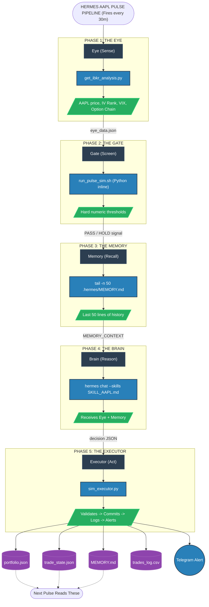
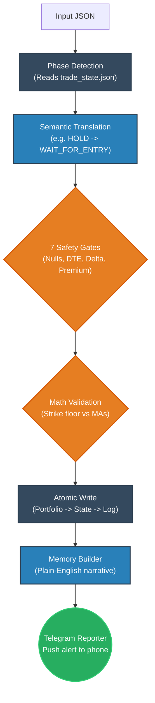
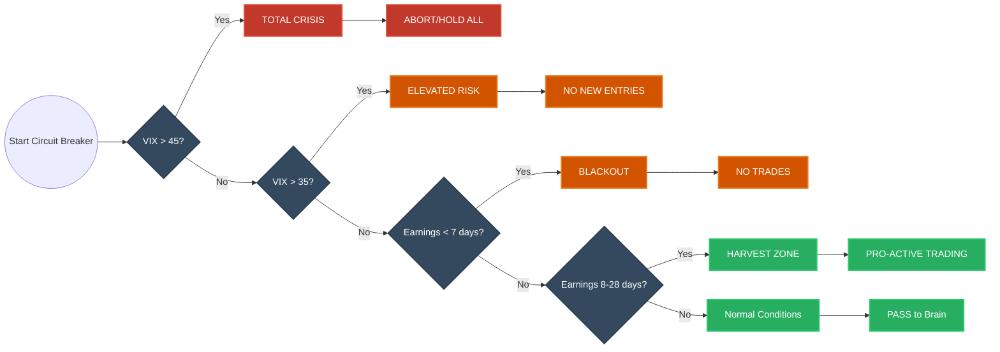
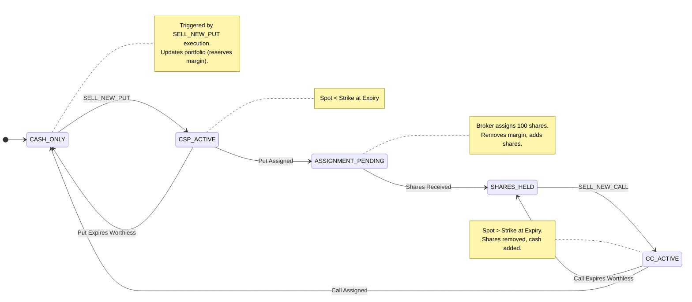

# HERMES AAPL SYSTEM DOCUMENTATION

## Table of Contents
1. [SECTION 1: COVER PAGE & SYSTEM IDENTITY](#section-1-cover-page--system-identity)
2. [SECTION 2: SYSTEM PHILOSOPHY](#section-2-system-philosophy)
3. [SECTION 3: COMPLETE ARCHITECTURE DIAGRAM (ASCII Art)](#section-3-complete-architecture-diagram-ascii-art)
4. [SECTION 4: FILE INVENTORY (Complete)](#section-4-file-inventory-complete)
5. [SECTION 5: MICRO-STEP DATA FLOW (Most Important Section)](#section-5-micro-step-data-flow-most-important-section)
6. [SECTION 6: THE STATE MACHINE — COMPLETE WHEEL CYCLE](#section-6-the-state-machine--complete-wheel-cycle)
7. [SECTION 7: COMPLETE DATA SCHEMAS](#section-7-complete-data-schemas)
8. [SECTION 8: SAFETY ARCHITECTURE SUMMARY](#section-8-safety-architecture-summary)
9. [SECTION 9: ENVIRONMENT & CONFIGURATION](#section-9-environment--configuration)
10. [SECTION 10: OPERATIONAL RUNBOOK](#section-10-operational-runbook)
11. [SECTION 11: PHASE 5 — ADAPTIVE LEARNING REVIEW](#section-11-phase-5--adaptive-learning-review)
12. [SECTION 12: GLOSSARY](#section-12-glossary)

---

## SECTION 1: COVER PAGE & SYSTEM IDENTITY

- **System Name:** Hermes AAPL Adaptive Wheel Trading Agent
- **Version:** 1.0 — Production
- **Author:** Ravichandran
- **Environment:** Linux/Ubuntu, Python 3.x, Hermes CLI
- **Date:** 2026-05-07
- **Purpose:** Autonomous options wheel strategy execution on AAPL with adaptive memory, institutional safety gates, and Telegram reporting.

Last Verified: 2026-05-07 | Status: PRODUCTION

---

## SECTION 2: SYSTEM PHILOSOPHY

The Hermes AAPL Adaptive Wheel Trading Agent is built upon a foundation of institutional-grade robustness, deterministic safety, and cognitive adaptability. Its architecture strictly adheres to the following core philosophies:

### 1. SEPARATION OF CONCERNS
The system decouples data acquisition, safety validation, cognitive reasoning, and trade execution.
- **The Circuit Breaker** is a "Dumb Switch" — it operates on hard numeric thresholds (e.g., VIX limits, days to earnings) and only knows STOP or GO. It never interprets market context or sentiment.
- **The Executor** is a "Semantic Translator" and "Bouncer". It takes the raw output from the reasoning engine and validates the mathematics. It also maps generic hold signals to correct domain actions (WAIT_FOR_ENTRY / HOLD_PUT_POSITION / HOLD_CALL_POSITION) based on the current portfolio phase.
- **The Brain** is a "Reasoning Engine" (Hermes LLM). It never touches local state files directly or makes executing API calls. It receives a sanitized payload of current market data, past memories, and strategy rules, and outputs a structured JSON decision.

### 2. CLOSED LEARNING LOOP
Unlike stateless scripts, Hermes evolves.
- Every pulse outcome—whether a trade was executed, aborted, or deferred—is translated into a plain-English narrative and appended to `MEMORY.md`.
- Before the Brain reasons on a new pulse, it reads the tail of `MEMORY.md`.
- The agent learns from its own history autonomously, recognizing patterns like delta creep, repeating conditions, or prior abort reasons.

### 3. FAIL-SAFE DESIGN
In production trading, software crashes are unacceptable.
- Every component failure must be non-fatal. If the IBKR API disconnects, the Eye returns empty data, which triggers a graceful "WAIT_FOR_ENTRY" rather than a script crash.
- The pipeline degrades gracefully at each phase. Null Guards in the Executor ensure that malformed LLM outputs are cleanly rejected.
- No single failure can corrupt portfolio state. All critical state updates (`portfolio.json`, `trade_state.json`) utilize atomic write sequences.

### 4. SEMANTIC ACCURACY
The agent's internal monologue and audit trails must reflect professional trading terminology.
- The language stored in `MEMORY.md` and `trades_log.csv` must be domain-accurate, not generic.
- A system with no positions that is waiting for the right setup records "Waited for entry", not the misleading "Held position". This ensures the Brain's historical context remains truthful and unconfused.

Last Verified: 2026-05-07 | Status: PRODUCTION

---

## SECTION 3: COMPLETE ARCHITECTURE DIAGRAM (ASCII Art)

### LEVEL 1 — THE 5-PHASE PULSE PIPELINE:



### LEVEL 2 — THE EXECUTOR INTERNAL FLOW:



### LEVEL 3 — THE CIRCUIT BREAKER LOGIC TREE:



### LEVEL 4 — THE STATE MACHINE (5 Phases):



Last Verified: 2026-05-07 | Status: PRODUCTION

---

## SECTION 4: FILE INVENTORY (Complete)

| Filename | Location Pattern | Type | Purpose | Read By | Written By | Critical Level |
| :--- | :--- | :--- | :--- | :--- | :--- | :--- |
| `run_pulse_sim.sh` | `/home/*/Live_Trade/` | Shell | Orchestrates the 5-phase pulse pipeline via sequential execution. | Cron | User | CRITICAL |
| `sim_executor.py` | `/home/*/Live_Trade/` | Python | Validates trades via 7 gates, executes state changes, and closes memory loop. | `run_pulse_sim.sh` | User | CRITICAL |
| `get_ibkr_analysis.py` | `/home/*/Live_Trade/` | Python | Connects to IBKR TWS API to pull live market and option chain data. | `run_pulse_sim.sh` | User | IMPORTANT |
| `SKILL_AAPL.md` | `/home/*/Live_Trade/.hermes/skills/` | Markdown | Contains institutional wheel strategy rules, thresholds, and domain logic for AAPL. | Hermes Brain | User | CRITICAL |
| `.env` | `/home/*/Live_Trade/.hermes/` | ENV | Stores sensitive API keys and configuration toggles securely. | Shell scripts, Python | User | CRITICAL |
| `MEMORY.md` | `/home/*/Live_Trade/.hermes/` | Markdown | The persistent cognitive log providing historical context for adaptive learning. | `run_pulse_sim.sh` | `sim_executor.py` | CRITICAL |
| `portfolio.json` | `/home/*/Live_Trade/` | JSON | Stores current account balances, equity holdings, and realized P&L. | `sim_executor.py` | `sim_executor.py` | CRITICAL |
| `trade_state.json` | `/home/*/Live_Trade/` | JSON | Tracks the current active phase and details of any open option positions. | `sim_executor.py` | `sim_executor.py` | CRITICAL |
| `trades_log.csv` | `/home/*/Live_Trade/` | CSV | The immutable audit trail of every pulse decision and executed trade. | User (Audit) | `sim_executor.py` | IMPORTANT |
| `setup_cron.sh` | `/home/*/Live_Trade/` | Shell | Configures the system crontab to execute the pulse script automatically. | User | User | UTILITY |
| `eye_data.json` | `/tmp/` or memory | JSON | Temporary payload containing the live market snapshot from Phase 1. | `run_pulse_sim.sh`, `sim_executor.py` | `get_ibkr_analysis.py` | IMPORTANT |

Last Verified: 2026-05-07 | Status: PRODUCTION

---

## SECTION 5: MICRO-STEP DATA FLOW (Most Important Section)

### PHASE 1 — THE EYE:
- **Script:** `get_ibkr_analysis.py`
- **Input:** IBKR TWS connection (port 7497) OR yfinance fallback
- **Output:** `eye_data.json` (captured via STDOUT)

**`eye_data.json` schema:**
```json
{
  "aapl_price": 287.18,          // float, Current AAPL market price
  "iv_rank": 70.8,               // float, 0-100 IV percentile rank
  "vix": 17.46,                  // float, CBOE Volatility Index
  "earnings_days": 85,           // int, Days until next earnings
  "ma_200": 255.99,              // float, 200-day moving average
  "low_52w": 194.68,             // float, 52-week low price
  "option_chain": [...]          // array, Available strikes and premiums
}
```

**Failure modes:**
- If IBKR is disconnected, the script attempts a `yfinance` fallback to gather basic price data.
- If data retrieval fails entirely or returns malformed data, the downstream Circuit Breaker or Null Guards will detect missing critical fields and force a safe HOLD state.

### PHASE 2 — THE CIRCUIT BREAKER:
- **Location:** Inside `run_pulse_sim.sh` (Python inline execution)
- **Logic:** Evaluates hard numerical thresholds before the Brain is invoked.
- **Output:** Either "PASS" (continue to Phase 3) OR "HOLD_PUT_POSITION" (skip Brain, go directly to Executor).

**EXACT THRESHOLDS:**
- `VIX_CRISIS_THRESHOLD = 45`
- `VIX_CAUTION_THRESHOLD = 35`
- `EARNINGS_BLACKOUT_DAYS = 7`
- `EARNINGS_HARVEST_MIN = 8`
- `EARNINGS_HARVEST_MAX = 28`

**Breach Handling:**
- **VIX > 45:** Signal becomes `HOLD_ALL`. Executor logs "ABORT DUE TO CRISIS VIX". Telegram alerts user of total halt.
- **VIX > 35:** Signal becomes `MANAGE_ONLY`. New entries blocked, but closing trades permitted.
- **Earnings < 7:** Signal becomes `BLACKOUT`. All new trades blocked to avoid binary event risk.

### PHASE 3 — THE MEMORY:
- **Command:** `tail -n 50 .hermes/MEMORY.md`
- **Variable:** `MEMORY_CONTEXT` (shell variable)
- **Injection:** Passed into the `hermes chat` prompt under the header `ADAPTIVE CONTEXT (Past Lessons)`.

**`MEMORY.md` entry format:**
```text
2026-05-07 16:48 IST | ACTION: Waited for entry | Phase: CASH_ONLY | AAPL: $287.18 | VIX: 17.46 | IV_Rank: 70.8% | Earnings: 85d away | Reason: No option chain data available to evaluate Phase 1 conditions. Holding until valid data is received. | Memory: No relevant memory found.
```

- **First pulse behavior:** The Brain is instructed to note "No relevant memory found".
- **Subsequent pulse behavior:** The Brain references prior entries to maintain strategic continuity (e.g., avoiding repeating a failed strike attempt).

### PHASE 4 — THE BRAIN:
- **Command:** `hermes chat --skills SKILL_AAPL.md --query "..."`
- **Input 1:** `eye_data.json` content (Live market)
- **Input 2:** `MEMORY_CONTEXT` (Last 50 lines of history)
- **Input 3:** `SKILL_AAPL.md` (Domain strategy rules)
- **Output:** Structured JSON decision printed to STDOUT.

**Output JSON schema:**
```json
{
  "action": "WAIT_FOR_ENTRY",      // string, Primary decision token
  "strike": null,                  // float|null, Option strike price
  "expiry": null,                  // string|null, Option expiry date
  "delta": null,                   // float|null, Option delta
  "premium": null,                 // float|null, Option premium
  "dte": null,                     // int|null, Days to expiration
  "reason": "Option chain empty.", // string, Plain English explanation
  "confidence": 0.95               // float, 0.0 to 1.0 confidence
}
```

**Valid action values:** `SELL_NEW_PUT`, `ROLL_PUT`, `CLOSE_PUT`, `TAKE_ASSIGNMENT`, `SELL_NEW_CALL`, `ROLL_CALL`, `CLOSE_CALL`, `WAIT_FOR_ENTRY`, `HOLD_PUT_POSITION`, `HOLD_CALL_POSITION`.

### PHASE 5 — THE EXECUTOR:
- **Script:** `sim_executor.py`

**The 7 Safety Gates:**
- **GATE 1: Null Guard:** Checks if `strike`, `delta`, `dte`, `premium` are `None`. Failure: ABORTED — missing field (Prevents TypeError crashes).
- **GATE 2: Action Whitelist:** Validates action against accepted tokens. Failure: ABORTED — unknown action.
- **GATE 3: Strike Floor:** Ensures CSP strike is >= `max(ma_200, 52_week_low)`. Failure: ABORTED — strike below floor.
- **GATE 4: Delta Sanity:** Checks CSP delta is <= 0.35. Failure: ABORTED — delta too high.
- **GATE 5: DTE Sanity:** Checks DTE is between 25 and 55 days. Failure: ABORTED — DTE out of range.
- **GATE 6: Premium Yield:** Checks premium >= 1.0% of strike. Failure: ABORTED — premium yield too low.
- **GATE 7: Earnings Check:** Checks DTE does not cross earnings date. Failure: ABORTED — expires past earnings.

**SEMANTIC TRANSLATION TABLE:**
| Circuit Breaker Signal | Current Phase | Executor Label |
| :--- | :--- | :--- |
| `HOLD_PUT_POSITION` | `CASH_ONLY` | `WAIT_FOR_ENTRY` |
| `HOLD_PUT_POSITION` | `CSP_ACTIVE` | `HOLD_PUT_POSITION` |
| `HOLD_PUT_POSITION` | `CC_ACTIVE` | `HOLD_CALL_POSITION` |
| `HOLD_PUT_POSITION` | `SHARES_HELD` | `HOLD_SHARES` |

Last Verified: 2026-05-07 | Status: PRODUCTION

---

## SECTION 6: THE STATE MACHINE — COMPLETE WHEEL CYCLE

The agent strictly follows the lifecycle of the Options Wheel Strategy.

### STATE 1: CASH_ONLY
- **Entry:** System start or after a covered call expires worthless/is closed for profit.
- **Action:** Output `WAIT_FOR_ENTRY` or execute `SELL_NEW_PUT`.
- **Files:** `portfolio.json` holds available cash; no active positions.
- **Next state:** Transitions to `CSP_ACTIVE` upon successful put sale.
- **Trigger Condition:** IV Rank is elevated, VIX is in ideal zone, and DTE/Delta constraints are met.

### STATE 2: CSP_ACTIVE
- **Entry:** Successfully executed `SELL_NEW_PUT`.
- **Action:** Output `HOLD_PUT_POSITION`, execute `ROLL_PUT`, or `CLOSE_PUT` (take profit).
- **Files:** `trade_state.json` updated with active put details. `portfolio.json` margin reserved.
- **Exit paths:**
  - a) Put expires worthless -> Back to `CASH_ONLY` (Premium realized).
  - b) Put closed at target profit -> Back to `CASH_ONLY`.
  - c) Put assigned -> Transitions to `ASSIGNMENT_PENDING`.

### STATE 3: ASSIGNMENT_PENDING
- **Entry:** Option expires with spot price below the strike price.
- **Action:** Administrative state to `TAKE_ASSIGNMENT`.
- **Files:** `portfolio.json` converts reserved cash into `aapl_shares`.
- **Next state:** Transitions to `SHARES_HELD`.

### STATE 4: SHARES_HELD
- **Entry:** 100 shares of AAPL acquired.
- **Action:** Monitor market recovery until conditions support selling a call above cost basis.
- **Next state:** Transitions to `CC_ACTIVE` upon selling a call.

### STATE 5: CC_ACTIVE
- **Entry:** Successfully executed `SELL_NEW_CALL`.
- **Action:** Output `HOLD_CALL_POSITION`, execute `ROLL_CALL`, or `CLOSE_CALL`.
- **Exit paths:**
  - a) Call expires worthless -> Back to `SHARES_HELD` (Premium realized).
  - b) Call closed at target profit -> Back to `SHARES_HELD`.
  - c) Call assigned (shares called away) -> Back to `CASH_ONLY` (Capital freed).

Last Verified: 2026-05-07 | Status: PRODUCTION

---

## SECTION 7: COMPLETE DATA SCHEMAS

### `portfolio.json`
```json
{
  "total_cash": 250000.0,         // float, Available cash in USD
  "reserved_margin": 0.0,         // float, Cash locked for CSP collateral
  "aapl_shares": 0,               // int, AAPL shares held
  "unrealized_pnl": 0.0,          // float, Current open position P&L
  "realized_pnl": 0.0,            // float, Total locked-in profit/loss
  "last_update": "2026-05-07T00:00:00" // string, ISO timestamp
}
```

### `trade_state.json`
```json
{
  "current_phase": "CASH_ONLY",   // string, Active phase in Wheel cycle
  "current_option_strike": null,  // float|null, Strike of open position
  "current_option_expiry": null,  // string|null, Expiry of open position
  "current_option_type": null,    // string|null, "PUT" or "CALL"
  "current_option_qty": 0,        // int, Number of contracts
  "avg_price": 0.0,               // float, Premium received (or cost basis)
  "last_decision": "WAIT_FOR_ENTRY", // string, Last executed action
  "last_pulse_timestamp": "2026-05-07T16:48:00" // string, ISO timestamp
}
```

### `trades_log.csv` Columns
`timestamp, action, strike, expiry, delta, dte, premium, pnl_pct, price_seen, vix, earnings, iv_rank, ex_div, status`

### `MEMORY.md` Entry Format
```text
[TIMESTAMP IST] | ACTION: [semantic_label] | Phase: [current_phase] | AAPL: $[price] | VIX: [vix] | IV_Rank: [rank]% | Earnings: [days]d away | Reason: [plain_english_reason] | Memory: [referenced_memory_context]
```

Last Verified: 2026-05-07 | Status: PRODUCTION

---

## SECTION 8: SAFETY ARCHITECTURE SUMMARY

The Hermes system employs a "defense-in-depth" safety model, nesting constraints from the outermost environment down to inner execution logic.

- **LAYER 1: Cron Schedule Gate** - Execution strictly bounded to configured market hours (IST 19:30 – 01:30) within `setup_cron.sh`.
- **LAYER 2: FORCE_PULSE Override** - The pipeline explicitly requires the `FORCE_PULSE` env var for out-of-hours testing, ensuring test runs cannot accidentally trigger live operations.
- **LAYER 3: Circuit Breaker (Python)** - A deterministic script within `run_pulse_sim.sh` that halts operations based on VIX thresholds and Earnings blackout windows before the Brain LLM is invoked.
- **LAYER 4: Brain Strategy Constraints (`SKILL_AAPL.md`)** - Encodes institutional-grade parameters (Delta 0.20-0.35, DTE 30-45) guiding the LLM's cognitive reasoning.
- **LAYER 5: Executor 7 Safety Gates** - `sim_executor.py` acts as a rigid enforcer. It employs "Null Guards" to prevent crashes from malformed JSON and mathematically re-verifies Delta, DTE, Floor Prices, and Yield requirements.
- **LAYER 6: SIM_MODE Flag** - Controls routing of orders. When `SIM_MODE=1` (default), trades are purely virtual and update local JSON files; real IBKR execution logic is bypassed.
- **LAYER 7: Atomic Write Sequence** - To prevent state corruption during execution crashes, files are updated in a strict order: 1) `portfolio.json`, 2) `trade_state.json`, 3) `trades_log.csv`.

Last Verified: 2026-05-07 | Status: PRODUCTION

---

## SECTION 9: ENVIRONMENT & CONFIGURATION

### Environment Variables (`.hermes/.env`):
```env
# Core API Keys
OPENAI_API_KEY        # Key for Hermes Brain reasoning
TELEGRAM_BOT_TOKEN    # Token for outbound Telegram alerts
TELEGRAM_CHAT_ID      # User's chat ID for direct messages

# System Toggles
SIM_MODE              # 1 = Paper trading (default), 0 = Live execution
FORCE_PULSE           # 1 = Bypass market hours check (testing only)

# IBKR Connection Details
IBKR_HOST             # Default: 127.0.0.1
IBKR_PORT             # Default: 7497 (Paper) / 7496 (Live)
```

### Cron Schedule (`setup_cron.sh`):
The pulse runs every 30 minutes during US Market Hours, localized to IST (UTC+5:30).
```cron
*/30 19-23,0-1 * * 1-5 cd /home/gbrithp2/Documents/krc_Lab/Live_Trade && bash run_pulse_sim.sh >> /tmp/hermes_cron.log 2>&1
```

Last Verified: 2026-05-07 | Status: PRODUCTION

---

## SECTION 10: OPERATIONAL RUNBOOK

### Daily Operations:
**Pre-market (before 7:25 PM IST):**
- [ ] Open IBKR TWS -> Login to Paper account.
- [ ] Ensure API is enabled in TWS Settings -> API -> Settings -> Port 7497.
- [ ] Verify cron active: `crontab -l | grep run_pulse`
- [ ] Check last system memory: `tail -5 .hermes/MEMORY.md`

**During market (7:30 PM – 1:30 AM IST):**
- [ ] Monitor Telegram alerts every 30 minutes.
- 🟢 Green alert = Trade executed (CSP sold, call sold, position closed)
- 🟡 Yellow alert = Waiting (Conditions unmet, normal operation)
- 🔴 Red alert = Circuit Breaker fired (Check VIX/Earnings)

**Post-market (after 1:30 AM IST):**
- [ ] Review session narrative: `tail -20 .hermes/MEMORY.md`
- [ ] Audit execution log: `tail -5 trades_log.csv`
- [ ] Verify phase state: `cat trade_state.json`
- [ ] Check end-of-day balances: `cat portfolio.json | python3 -m json.tool`

### Emergency Commands:
- **Kill all pulses immediately:** `crontab -r` (Warning: removes all jobs)
- **Check active pulse:** `ps aux | grep run_pulse_sim`
- **Force manual pulse:** `export FORCE_PULSE=1 && bash run_pulse_sim.sh 2>&1`
- **Read full memory:** `cat .hermes/MEMORY.md`
- **Audit trade log:** `cat trades_log.csv | column -t -s','`

Last Verified: 2026-05-07 | Status: PRODUCTION

---

## SECTION 11: PHASE 5 — ADAPTIVE LEARNING REVIEW

The true power of the Hermes system lies in its continuous improvement cycle. The `MEMORY.md` file serves as the basis for strategic evolution.

### Periodic Review Process:
After every 5 complete wheel cycles (from `CASH_ONLY` back to `CASH_ONLY`), perform a manual system review:
1. **Narrative Review:** Scan `MEMORY.md` to identify recurring AI reasoning patterns. Is the bot repeatedly skipping trades due to a specific tight constraint?
2. **Entry Timing:** Evaluate if chosen Deltas resulted in comfortable margin or immediate heat.
3. **Roll Execution:** Did the system successfully roll out of challenged positions before assignment?
4. **Skill Refinement:** Based on the review, manually update `SKILL_AAPL.md` to loosen or tighten thresholds (e.g., adjusting acceptable DTE range or minimum premium yield).

### Core Metrics to Track:
- **Win Rate:** Percentage of complete cycles where option premium was retained without assignment.
- **Average Premium/Cycle:** Metric of capital efficiency.
- **Assignment Rate:** Frequency of entering `SHARES_HELD` phase.
- **Recovery Time:** Number of days required to exit `SHARES_HELD` via covered call assignment.
- **Total P&L:** Running cumulative profitability tracked in `portfolio.json`.

Last Verified: 2026-05-07 | Status: PRODUCTION

---

## SECTION 12: GLOSSARY

- **Wheel Strategy:** An options strategy involving selling cash-secured puts, taking assignment of shares if necessary, and then selling covered calls on those shares.
- **Cash-Secured Put (CSP):** Selling a put option while holding enough cash in reserve to buy the underlying stock if assigned.
- **Covered Call (CC):** Selling a call option while owning 100 shares of the underlying stock.
- **Assignment:** The obligation to buy (on a put) or sell (on a call) 100 shares of stock at the agreed strike price.
- **Delta:** The expected change in option price per $1 change in the underlying stock; often used as a proxy for probability of expiring in-the-money.
- **DTE (Days to Expiration):** Calendar days remaining until the option contract expires.
- **IV Rank:** A measure of implied volatility relative to its one-year high and low, from 0 to 100.
- **Premium:** The cash received by the seller of an option contract.
- **Rolling:** Closing an existing option position and opening a new one, typically to extend time (DTE) or adjust strike, ideally for a net credit.
- **VIX:** CBOE Volatility Index, representing market expectation of 30-day forward volatility. Used as a macro risk gauge.
- **Circuit Breaker:** A deterministic, non-AI logic layer that halts trading during extreme conditions.
- **Semantic Translation:** Converting generic machine states into accurate domain terminology (e.g., mapping `HOLD` to `WAIT_FOR_ENTRY`).
- **Closed Learning Loop:** An architecture where the output (memory) of pulse N becomes an input for pulse N+1.
- **Null Guard:** Defensive programming checks that safely catch and handle missing data (`None` types) to prevent system crashes.
- **Atomic Write:** Updating a state file completely and safely, ensuring it is never in a partially written, corrupted state upon unexpected exit.
- **SIM_MODE:** Environment toggle setting the agent to paper trade using virtual portfolio balances.

Last Verified: 2026-05-07 | Status: PRODUCTION
